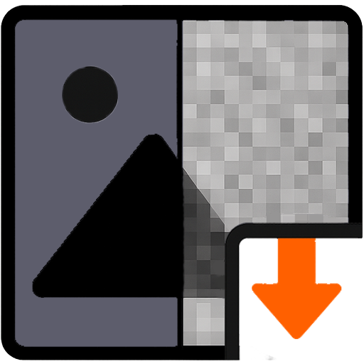

# LowResify

<div style="display: flex; align-items: center;">
  
  <p>
    Looking for an image enlarger or upscaler?
    Sorry, this isn’t the place. Instead, this tool is made to compress — or more accurately, pixelate — your images in the simplest way possible.
  </p>
</div>

No need for advanced editing skills or heavy photo software. Just drag and drop your photo, and **LowResify** will do the rest.

## Origin

Honestly, I don’t know how else to put it — pixelated memes inspired me to create this weird little project.

## Development

This project uses [Bun](https://bun.sh) due to its speed and modern for the Node.js runtime.

### Test & Build

```bash
bun install
```

> [!NOTE]  
> After installation you might see some postinstall scripts are rejected automatically by Bun itself.
>
> You can list all untrusted scripts using command:
>
> ```bash
> bun pm untrusted
> ```
>
> Trust and run all of them with:
>
> ```bash
> bun pm trust --all
> ```

```bash
bun run dev
```

```bash
bun run build
```

### Linting

Using [ESLint](https://eslint.org) default configuration from [Vite](https://vite.dev) setup.

```bash
bun run lint
```
